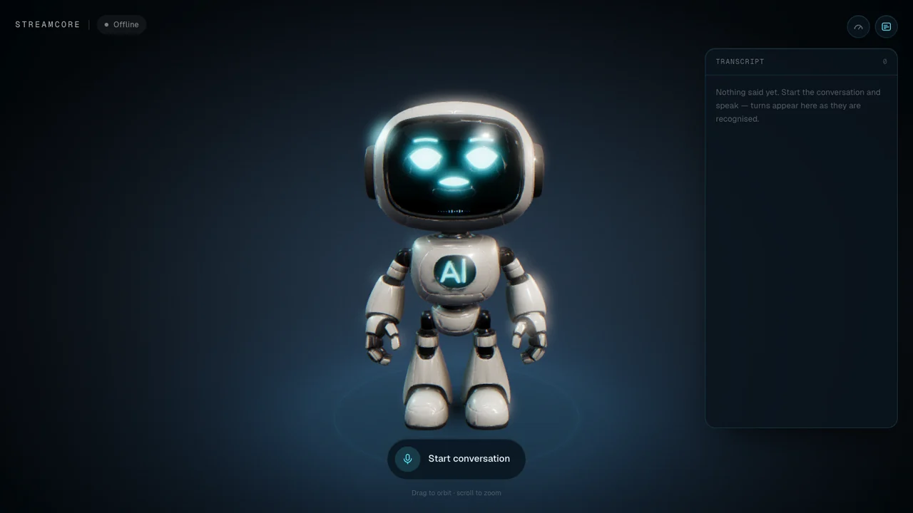

# 语音机器人

一个有表情的语音助手。Babylon.js 渲染的机器人通过
[`@streamcore/js-sdk`](https://www.npmjs.com/package/@streamcore/js-sdk) 以 WebRTC 连接 StreamCore
服务端，并对对话双方同时作出反应：眼睛跟着你走，嘴型跟着 agent 的声音动，等待、思考、回答都看得出来。
让它走近一点或者转个身，它也会照做——驱动它的，正是驱动 ESP32 小车的那套服务端工具。



和其他客户端示例不同，这个示例不是最小化的。它要回答的是另一个问题：当界面不是波形图而是一个角色时，
一次 StreamCore 会话是什么样子。

## 运行

需要一个跑在 `:8080` 的 StreamCore 服务端。最快的搭建方式见 <https://streamcore.ai/llms.txt>。

```bash
npm install
cp .env.local.example .env.local
npm run dev            # https://localhost:3000
```

`next dev` 带 `--experimental-https`，因为 `getUserMedia` 需要安全上下文。首次访问请接受自签名证书。

如果没有服务端在监听，连接按钮始终可以取消，并会在九秒后说明它正在等待哪个 URL。一个取消不掉的拨号，
是发现服务端没起来的最糟糕方式。

如果服务端的 `config.toml` 设置了 `jwt_secret`，它会拒绝未认证的连接——按 `.env.local.example` 的说明
填上 `NEXT_PUBLIC_TOKEN_URL`（以及 `NEXT_PUBLIC_API_KEY`）。连接失败时会直接说明是哪一项不对，而不是
甩出一句 `TypeError: Failed to fetch`。

处理好的模型（`public/models/bot.glb`，5.2 MB）已提交，全新克隆即可运行。如果你手上有 82 MB 的原始导出
文件 `models/bot.glb`，想重新生成：

```bash
npm run prepare:model              # 默认：保留 10% 三角面，2K 贴图
npm run prepare:model -- --ratio 0.25 --texture 4096
```

## 给没有骨骼的模型加上表情

源模型是一个 150 万三角面的单一网格，**没有骨骼、没有 blend shape、没有动画**，脸是直接画进 4K
基础色贴图里的。没有任何东西可以驱动。所以这张脸不是"动画"出来的，而是每一帧**画**出来，再投影到面罩上。

**构建期**（`scripts/prepare-model.mjs`）：

- 把落在面罩包围盒内的所有三角面光栅化到 UV 空间，并把这些纹素刷回玻璃本身的颜色，从而抹掉贴图里画死的
  眼睛和嘴。
- 贴图里剩下的青色——耳环、胸口徽标——生成一张自发光遮罩，于是运行时这些部位可以跟着 agent 的声音亮起来，
  而不再是一块死的颜色。

**运行期**（`lib/bot/faceMaterial.ts`）：

- 克隆身体网格。Babylon 的克隆共享几何数据，所以代价是一次 draw call，而不是再来一份 15 万三角面。
- 克隆体的着色器**直接采样基础色贴图**来判断哪里是面罩：接近黑的是玻璃，接近白的是外圈边框。因为遮罩来自
  贴图本身，它天然贴合玻璃的曲面，不可能和几何错位。
- 脸部画布以预乘 alpha 合成，所以没画到的地方，面罩保留自己的高光。把整块屏幕换成一个纯色矩形，正是这类
  做法看起来像贴纸的原因。

需要测量的只有那个包围盒，它以模型包围盒的比例形式存放在 `lib/bot/visor.json` 里，构建脚本和运行时共用；
即使模型以不同尺度重新导出，它依然成立。

## 这张脸由什么组成

`lib/bot/expression.ts` 里是十六个数值——眼睛开合与弧度、眉毛抬起与角度、嘴的开合／宽度／弧度、视线、
辉光、色调——每个都以各自的速率向目标阻尼收敛。每种表情都只是对静息值的一次局部覆盖。

| 会话状态 | 表情 |
|---|---|
| 空闲 / 已断开 | `offline` —— 闭眼，辉光降到最低 |
| 连接中 | `boot` —— 眯眼，偏暗 |
| 已连接 + `listening` | `listening` —— 睁大眼、眉毛微抬、带一点准备好的微笑 |
| 已连接 + `thinking` | `thinking` —— 转紫色，视线移开，嘴变成三个跳动的点 |
| 已连接 + `speaking` | `speaking` —— 嘴型由 agent 的音频驱动 |
| 静音 | `muted` —— 眼神躲开，嘴闭紧 |
| 出错 | `error` —— 转琥珀色，眉毛内压，嘴角向下 |

在这之上还有一层不由自主的细节：随机间隔的眨眼（偶尔连眨两下）、眨眼之间的扫视、辉光的呼吸脉动、重音节
上微微眯眼。机器人还会朝你的指针方向转过去一点；点它一下，它会笑。

嘴型来自 agent 音频的 RMS 包络，并以一个缓慢衰减的上限做归一化，因此音量小的 TTS 声音和音量大的一样能
把嘴带起来；攻击快、释放慢。宽度目标每秒重新随机几次，避免嘴像节拍器一样机械地开合。

## 怎么让"站着不动"看起来可信

下面那套运行时骨架只在走动时驱动四肢；站着不动时，机器人转头就必须一起转脚。待机动作全是整体的，这排除了大幅度的动作，也让"规律"变得
致命——一条正弦曲线两个周期之内就会被看成机械。`lib/bot/idleMotion.ts` 叠了三层互不同步的东西：

- **呼吸**：走自己的慢时钟，大约每分钟十一次，深浅还会缓慢漂移，所以没有两次呼吸是一样大的。
- **连续噪声**：所有轴同时进行的低频游移，每个轴有各自的频率和随机种子，因此永远不会重新对齐相位。
- **手势**：按随机时间表触发，允许彼此重叠——把重心压到一只脚上并保持一会儿的重心转移、由眼睛提前带出的
  瞥视、歪头、会衰减而不是保持的点头，以及细小的沉降。

旋转的支点在双脚之间，因为模型原点就在那里——这正是一个站立的身体转移重心时的样子。

"注意力"是会过期的：指针几秒钟没动，就不再算是要求机器人看的东西，于是它会自己开始四处张望。agent
说话时，手势频率大约翻倍并偏向点头，重音节还会额外带一点强调。

四十秒的实测：偏航角大致在 ±8° 以内，俯仰和翻滚小于 2°，身体漂移约一厘米——足以让它不显得僵住，又不至于
看起来在滑动。

## 场景房间

机器人站在一间办公室的高斯泼溅扫描里（`hightech-office.spz`，76.8 万个 splat，12 MB）。可以在顶栏切换，
原来的暗色影棚舞台仍然在它后面。

关于这个格式，有两点值得知道，因为它们决定了这里的接法：

- **加载器默认会把扫描镜像掉。** `flipY` 不开时，它会给 splat 网格加上 `scaling.y *= -1`，因为常规训练出来
  的 splat 是 Y 朝下的。而这份扫描既不是 Y 朝下、也不是 Y 朝上——它是 **Z 朝上**的，所以那次翻转不是修正，
  而是沿着走廊长边的一次镜像。传 `flipY: true`（意思是"别动这份数据"）是下面所有摆放能成立的前提。
- **这个文件是套了 gzip 的 SPZ v3，所以 Babylon 内置的解析器就能读。** 否则加载器默认会去 unpkg 取一个
  WASM 模块，而 **v4+（裸 NGSP）** 文件是*必须*要它的——原生兜底解析器会直接拒绝。这个文件不需要，所以
  `spzLibraryUrl` 被显式设为 `undefined`，运行时不依赖任何 CDN。换扫描之前先看头几个字节：`1f8b` 是这里能
  直接读的 gzip，`4e475350` 是 NGSP，得走 WASM 那条路。
- **扫描应用在 splats 旁边导出的那个 `.ply`，通常是碰撞网格，不是 splats。** `models/` 里的这个是 Open3D
  导出的三角网格——20.2 万顶点、40 万面、顶点色，没有任何 splat 属性。它适合做拾取、物理或相机碰撞，而这个
  示例都不做，所以没有任何代码加载它——下面的地板平面和可行走区域都是直接从 splats 上量出来的。

摆放是从点云里量出来的，不是靠眼睛估的。换任何一份扫描进来都该走一遍这套流程，而第一步不是走过场——跳过它
正是当初机器人站到墙上去的原因。

1. **先搞清楚哪边朝上。** 把点云沿三个轴分别投影，然后去看这三张图：只有一张是平面图。这里是沿 Z 的那张，
   所以这份扫描是 **Z 朝上**的，地板是 z ≈ -1.55 处的一层，天花板是 z ≈ +2.6 处的另一层。
2. **摆平。** 对那一层里的 11.6 万个 splat 做最小二乘平面拟合（只取室内，把墙排除在外），地板偏离水平
   2.8°——手持扫描很正常，但一旦让一个绝对垂直的机器人站上去就非常刺眼。整份扫描会被旋转，把这条法线转到
   +Y 上。用最小二乘而不是 RANSAC：RANSAC 在这份点云上给出的法线带了一个并不存在于地板里的翻滚分量，
   "修正"它反而把房间朝另一边拧了过去。
3. **然后决定机器人在里面有多大。** 这和"扫描量出来是多少"不是同一个问题。这一份大约是米制的两倍，
   `ROOM.scale` 取 1.25，机器人在走廊里就小到能读成"一个站在办公室里的机器人"，而不是"一个压在办公室上的
   机器人"。扫描本身是米制的也不代表就完事了：scale 取 1 时机器人就是模型给的那个高度，而画面里只有它的
   大小是眼睛本来就知道的，别的东西全都被拿去和它比——一间真实尺寸的房间是可能因此读成储物间的。
4. **转向。** 房间长边 17.3 单位、宽约 7 单位。不转的话，相机拉开的距离会落到侧墙外面；转四分之一圈之后，
   镜头是顺着办公室的长边看过去的。
5. **找到真正能站的地板。** 包围盒中心——最顺手的那个选择——其实在**办公桌那一排里面**。于是把拟合地板以上
   0.25–2.2 单位之间的东西按 25 厘米的格子分箱标成障碍，再给空闲格打分：可用净空半径，以及各个方向上地板
   还能延伸多远。胜出的位置有 1.25 单位的净空半径、相机拉开的那一侧有 5.5 单位的通道、身后有 9 单位作为
   有纵深的背景。

由此得到的常量都放在 `lib/bot/config.ts` 里，紧挨着产生它们的测量值。

有一件事完全不在上面这些测量里：相机该放在哪，以及它要不要动。它不动。它站在走廊里 5.2 m 外、2 m 高的位置，
然后就待在那儿——机器人在画面里走来走去，而不是画面跟着机器人走。会跟随的相机会把机器人钉在屏幕中央、让房间
在背后滑过去；挂在它肩后的相机则会让整件事变成"你在操控的东西"。这两样都不像一个站在办公室里的机器人。

正因为它不动，上面那两个数字才有意义。**5.2 m** 差不多是这个房间能退到的极限：相机这一侧的空地有 6.9，但最后
那一段就是近处的那排办公桌，而离镜头一米的 splats 不是家具，是糊在画面底部的一片白。**2 m 高**比站立视高再高
一个头，正是这一点把那排桌子挤出了画面底边；放在视高上，它就正对着镜头，整个画面等于是从桌子中间看过去。从
这个位置看，机器人能走的那片空场整个都在画面里，所以行走边界可以按地板来定，而不必按取景来定。

拖拽本身也是锁死的，理由和挑这个机位是同一个。`minBeta`/`maxBeta` 只允许相机在 2.8 m 到 1.45 m 这段高度里
上下，再多没有：之前的上限越过了 π/2，而一旦越过 π/2，相机就跑到了它所瞄准的东西*下面*——贴着地板，沿着过道
从近处那排桌子中间往上看，是这个房间里唯一一个一无是处的取景。左右则被限制在 0.28 弧度、约 1.4 m 的摆幅，
因为从 5 m 外看，一点角度就是一大段距离，而这个房间只有 5 宽。

`CAMERA.bounds` 是这道锁的后备，也是那套跟随相机留下的保险：相机自己必须待在里面的一个盒子——splats 没有可以
求交的几何。现在只有用户拖拽才够得着它，到了边上是把镜头拉近而不是让它穿过去。换一份更局促的扫描进来时，它
仍然是第一个该检查的东西。

Splats 自带烘焙好的光照，不参与场景光照，所以打开房间时灯光也要跟着改——主光从 2.6 降到 1.15、曝光从 1.15
降到 0.95，并关掉那套"虚空布景"（渐变背景、地面光池），它们本来只是为了让机器人有个立足之处。半球光的地面色
也跟着走，因为反弹光带的是它反射自那块地板的颜色——这间办公室是冷色调，所以用冷灰；换一份暖色的扫描就该跟着
改，否则机器人看起来会像是被合成进去的，而不是站在里面。接触阴影两种情况都保留：悬空一厘米站在真实地板上是
很显眼的。

**关于性能，一个诚实的说明。** 76.8 万个 splat 不算少，而开发过程中能用的只有软件光栅化器，所以这里的帧率
从未在真实硬件上测过。场景对此是有防备的：低档硬件根本不会加载房间；如果后期处理已经降过档、帧率仍然低于
40，场景会自己把房间关掉并通知 UI。上线到目标设备前请自行验证。

## 让它动起来

让机器人走近一点、后退、左转、停下，或者跳一段，它都会照做。这些在浏览器里一句都没有解析——服务端本来就
带着这套词汇，这个示例只是第二个会说它的客户端。

服务端注册了十一个原生 `movement.*` 工具（`server/internal/tools/movement.go`），并且在传统的 STT→LLM→TTS 链路和
实时语音到语音链路里都会把它们交给模型。模型调用其中一个时，服务端并不执行任何动作：它拦下这次调用，把一小
段 JSON 用 base64 包好，从传输字幕的那条 `events` 数据通道推下来。

```json
{"type":"data","topic":"movement.command","payload":"eyJhY3Rpb24iOiJ0dXJuX2xlZnQiLCJkdXJhdGlvbl9tcyI6ODAwfQ=="}
```

```json
{"action":"turn_left","duration_ms":800,"speed_percent":80}
```

这是"发完就不管"的。客户端这边没有任何东西在等它，而且在包还没上线之前，模型就已经拿到了一句可以念出来的
回执（*"Turning left."*）。所以既没有要回传的结果，也没有需要对应的调用 id——同样的道理，
[`examples/esp32-desktop-car`](../esp32-desktop-car) 里的固件才能把命令丢进一个有界队列后立刻返回。

也就是说，在服务端看来这两个客户端是同一个客户端。`lib/bot/movementCommand.ts` 解的正是固件里
`parse_movement_command` 解的那份载荷，并且把它那张默认值表照抄了一遍而不是想当然——因为模型没有指明时，服务端
会把 `duration_ms` 和 `speed_percent` 整个省掉。一个浏览器标签页和一台两轮小车，对同一句话给出同样的反应；
只不过一个转的是网格，另一个转的是电机。

只有"翻译成走路"这一步不一样。小车调的是轮子占空比，而这个机器人始终以一个舒服的速度走，所以
`speed_percent` 被折进了*走多远*而不是走多快——在固定时长下两者得到的距离是一样的，而这正是模型挑这个数字
时在算的东西。四个 `pivot_*` 动作变成了带曲率（弧度每米）的弧线行走，读起来是转弯而不是原地打转。

**"一直走到我喊停"** 需要 `continuous: true`，因为其它每一个移动都是定时长的，而最长也只有十秒。没有这个
标志时，模型会用"走一步"来回应一个开放式的请求，然后继续说自己还在走——而屏幕上明摆着不是。continuous 会
请求一段比房间还长的距离，交给行走边界去裁剪，于是机器人一直走到尽头才停，或者在 `movement.stop` 到达时提前
停下。这个字段在线上是 `omitempty` 的，所以从没听说过它的固件读到的仍然是原来那个时长。

还有一个措辞上的坑，因为服务端根本看不见连上来的是哪种客户端：`movement.*` 的描述、念出来的回执、以及驾驶
skill，原本都写的是 "drive"。于是一个走路的角色会把自己叙述成在开车，而这是用户一眼就会注意到的。现在这
三处都改成了与设备无关的说法，并且 skill 会让模型跟着用户自己用的那个动词。

跑这套的是 `lib/bot/locomotion.ts`，腿则由 `lib/bot/rig.ts` 带动——见下一节，因为这个模型本身是没有骨骼的。
在四肢之上，整个身体还带着每一步的上下起伏、由加速度而不是速度产生的前倾（匀速走时是直的，起步时前倾，
刹车时后仰），以及频率只有起伏一半的侧倾，让重心看起来在两脚之间转移。走动时待机小动作会降到四分之一强度；
不降的话，一段走路会变成踉跄。

步态周期是按**走过的距离**推进的，不是按时间，所以腿跟的是地面而不是时钟——速度减半时步幅不变，只是慢下来。
原地转身不产生位移，但脚仍然在动，所以它也会以一个折算后的比例推进同一个周期；没有这一条，机器人转圈时两只
脚就像焊在一起。

三个很容易做错的细节：

- **步骤是排队的，不是互相覆盖的。** 一句话里经常带两个（"往前走，然后左转"），按顺序执行才是唯一符合原意
  的理解。`stop` 是例外：它会清空队列并刹车。
- **地面贴花必须跟着机器人走**，否则它会从自己的影子上滑出去。接触阴影和辉光环挂在一个跟随它的 `ground`
  节点上；地面光池不跟，因为那是给"虚空"用的舞台灯光，而不是机器人随身带着的东西。
- **可走的地板不是一个方盒。** 在站位附近，两排办公桌让开成一片 5.3 宽的空场；再往两头走，地板收窄成一条
  约 1.5 宽的过道，而这条过道几乎贯穿整个房间。`WALK` 描述的就是这个形状——靠近原点是一段宽的、越过之后
  渐变成一段窄的——而不是"同时装得进两者的最大矩形"，因为那个矩形就是过道的宽度，等于把整片空场浪费掉。
- **要量"跨度"，不是量一条射线。** 当初挑站位用的净空数字，是沿着中线看开阔地板能延伸多远。那条射线正好
  从桌子之间穿过去，于是把过道报成了和空场一样宽。改成在每一步上取*最宽的一段连续净空*，收窄的位置才现形。
  这一步搞错，要么让机器人穿模走进家具，要么就像这次一样，把它圈在整个房间的一小块里。
- **注意单位。** 占用格是按扫描单位量的，而 `WALK` 是世界单位，所以凡是从格子里量出来的数，进来之前都得
  先乘上 `ROOM.scale`。之前有一个半宽悄悄漏掉了这一步，结果机器人连过道宽度的一半都没拿到。
- **边界同样要对着"一条指令走多远"来定。** 默认的 `movement.forward` 是 1500 ms、80%，也就是 0.74 m。早先的
  版本朝相机方向只给了 0.9 m，于是机器人第二步就撞墙，之后每一句"过来一点"都一动不动。收得这么紧，看起来
  不像是被限制住，而像是坏了。
- **相机这次不帮忙。** 它是不动的，所以上面每一条边界同时也是机器人能离开画面中心多远、能变得多小。房间让
  这件事负担得起：从 5.2 m 外看过去，那片空场整个都在画面里，所以边界仍然可以按地板来定而不是按取景来定。
  但如果你把它们放宽，记得对着画面再核一遍。

距离和算出来的一致——`movement.forward` 用模型默认的 1500 ms、80% 会走 0.75 m，`movement.turn_left` 800 ms 转 70°，
撞上办公桌时是被夹住而不是穿模。开发模式下有一个控制台入口，所以这些不需要服务端也能试：

```js
__voiceBot.scene.drive({ action: "forward", durationMs: 1500, speedPercent: 80 })
__voiceBot.scene.drive({ action: "fancy", durationMs: 3000, speedPercent: 80 })
__voiceBot.scene.recentre()
__voiceBot.drive.current.forward = 1     // 置 0 就是松手
```

## 自己开着它走

同一双脚也接 **WASD**——方向键也行，触屏上则是左下角那块方向盘。W 和 S 前后走，A 和 D 原地转，按住 shift 是
跑，R 让它走回出发的位置。左右是转身而不是横移，因为转身才是这个机器人会做的动作：这几个键覆盖的正好是
`movement.*` 那一套动作，不多也不少。

按住不放是一种状态，不是一条指令，所以它不进队列——它清空队列。手放在键盘上的人刚刚否掉了模型的要求，两边
同时抢同一双脚只会看起来像故障，而不像在商量。`Locomotion.setDrive` 因此是每帧调用而不是在按键时调用：否则
在手动驾驶*期间*到达的指令会一直躺在队列里，等松手之后才执行——而它当初是按另一个位置、另一个朝向算出来的。

另一处差别是家具。一条指令在开始之前就会被裁到实际可走的距离，所以它永远够不到办公桌；而一个键可以一直按
着顶上去，光靠夹住位置会让机器人贴着桌子原地踏步。所以手动驾驶会往前探 `WALK.clearance` 那么远，够不着就
干脆不走。

两个不注意就会中招的小地方：

- **Babylon 的 `ArcRotateCamera` 默认就占着方向键**，于是相机和机器人会一起响应同一个键。这个输入在
  `stage.ts` 里被移除了。
- **按下的键是 React state，驾驶输入本身是 ref。** state 只是用来把按钮点亮，而且只在按键时变，不是一秒变
  六十次。场景在渲染循环里读那个 ref，和读音频电平是同一套做法——见下文。

**相机不跟着这些键走。** 它根本就不动：站在房间里，瞄着出发的那个位置，机器人在画面里走来走去。走远了，你
是从办公室这一头看着它的背；转回来，就看得到脸。把相机挂到它肩后——也就是游戏里那种第三人称——会让它变成一个
你*在操控*的东西，而不是一个你在旁边看着的东西，而这个示例真正想展示的那张脸，也就从此不在画面里了。

## 手臂和头

脚只是其中一半。`bot.*` 这一组工具——一共十四个，在 `server/internal/tools/bot.go` 里——可以在机器人不挪窝的
情况下动头和手臂：挥手、单手或双手举起、左右指、上下左右看、环视一圈、点头、摇头，以及回到自然姿态。

"只举一只手"需要它自己的工具，而不是在 `bot.raise_arms` 上加一个表示左右的参数。当时只有"双手"这一个工具
可选，模型面对"把左手举起来"就用了手头最接近的那个——也就是两只手一起举——而为一只手的请求举起两只手，在
屏幕上是一眼就能看出来的。每一侧各做成一个工具，理由和 `movement.turn_left` / `movement.turn_right` 分开是一样的：
让模型选工具，比让它抽参数可靠。

它们走的是和传动指令同一条"发完就不管"的路，只是换了一个 topic：

```json
{"type":"data","topic":"bot.gesture","payload":"eyJhY3Rpb24iOiJ3YXZlIiwiZHVyYXRpb25fbXMiOjE4MDB9"}
```

用一个独立的 topic，而不是往 `movement.*` 里再加动作，是因为两轮传动根本没有手臂——设备可以整个忽略
`bot.gesture`，而不必去分辨自己做不了哪几个动作。浏览器这边把两类放进同一个有序队列，因为"左转然后挥手"
是有先后的。

**左右一律是机器人自己的左右**，从它站的位置看，和 `movement.turn_left` 一致。这一点值得写出来，因为机器人是面
对着你的：它的左手在你屏幕的右边，绑定权重也是按这个来分的。第一版把左右按观众视角写，结果 `point_right`
抬错了手。

姿态会自己保持一段时间再自己松开，所以不需要谁记得把手放下来；新的姿态会顶掉正在播的那个，而不是叠加上去。
每个姿态只接管它点名的那几个关节：`look_left` 只转头，手臂照样跟着走路摆动——走路姿态和手势姿态是按关节
分别混合的，不是整体二选一。

关于给这个模型摆姿势，有三点：

- **Babylon 是按创建顺序给骨头编号的。** 顶点权重用常量来指骨头，两边必须对得上；而把头骨放在踝骨之前
  创建，就悄悄把这两套编号错开了。静止时每根骨头都是单位变换，所以在机器人走起来之前什么都看不出来——
  一走，头就跟着一只脚摆，两个踝关节也都不再回正。这看起来像是绑定没做好，而不像是差了两位，所以
  `attach` 现在会断言顺序和编号一致。

- **抬手要往两侧抬，不是往前抬。** 沿走路用的那个轴往前抬，手臂会直接从头里穿过去——这个机器人的手臂长度
  和肩到头顶的距离差不多。往外展开（abduction）才读得出"举起手"。
- **头是这个机器人最宽的部位。** 手臂的权重是按宽度设闸的，因为手在同样的高度上垂在腿的外侧。头要是也这么
  设闸，它自己的两侧就会被划回身体上；所以头只按高度设闸，界线放在脖子——模型上最窄的一段，在 0.58–0.63。

`bot.look_around` 是唯一一个用单个振荡器不够的手势。一条正弦大约两个周期之后就会被读成机械运动——待机动作
靠叠三套时钟解决的正是这个问题——所以这个环视让头的偏航和俯仰各跑一个互不整除的频率，两者永远不会重新对
上相位。它在幅度和速度上也刻意和 `bot.shake_head` 拉开：那是同一个通道、四倍的频率；不拉开的话，"环视"和
"摇头说不"会被读成同一个动作的两种速度。

`bot-gestures` 这个 skill 还会让模型在合适的时候主动用这些动作：打招呼时挥手，同意时点头。但有节制，因为
每句话都点一下头的机器人，就不像是真的在点头了。

```js
__voiceBot.scene.gesture({ kind: "wave", seconds: 2 })
__voiceBot.scene.gesture({ kind: "point_left", seconds: 3 })
```

这需要 `@streamcore/js-sdk` **0.1.7 或更高版本**：更早的版本会把 `data` 包解出来然后直接丢掉，因为它的联合
类型里没有对应分支。现在 SDK 会以 `onData(topic, payload)` 的形式交出来，base64 已经解好。

## 给没有骨架的模型现场绑一套骨架

机器人导出的是一整块焊死的网格：一个节点、一个图元，没有蒙皮、没有动画。站着不动时这还能对付过去，一旦它
真的走起来就明显不对——腿会原地不动地滑过去。

所以骨架不是烘焙进资源里的，而是在加载时按网格自身的比例现场搭出来的。七根骨头——一根永不移动的根骨、两个
髋、两个肩、两个踝——每个顶点按它在包围盒里的位置绑到其中一根上。代价是对 13.6 万个顶点做一遍遍历，模型
处理流水线一行都不用改，而且换一个不同缩放的重新导出版本它照样能绑。

真正值得测量的是"哪些顶点属于哪里"。按高度切片看，腿是沿中线往上走的，横向大约到半宽的 0.62；而**手在同样
的高度上垂在腿的外侧**，从 0.17 往上，两者之间在 0.55–0.64 处有一条清晰的空隙。所以腿的权重不只按高度、还
要按横向宽度设闸：髋部以下的东西并不都是腿。权重用 smoothstep 过渡而不是在阈值处硬切，否则网格会沿着阈值
恰好落在的那条线上裂开。

其中有两件事很容易做错，而且各花掉了一轮调试：

- **网格的局部空间不等于世界空间。** 蒙皮是在网格局部坐标里做的，而这个模型的 glTF 节点带着一个 +90° 的 X
  轴旋转，于是局部 −Z 才是世界的上，局部 +Z 是*下*。按直觉写出来的高度探测会把机器人整个量反，把头顶当成
  脚。`deriveAxes` 是从网格的世界矩阵里把这个映射读回来的，而不是假设它，所以换一种约定重新导出也还能绑对。
- **`Bone.updateMatrix` 不是用来摆姿势的。** 它在改局部矩阵的同时也把骨头的**绑定**矩阵一起改了，于是逆绑定
  矩阵正好把姿势抵消掉，网格一动不动——一套在所有调试输出里都完全正确、在屏幕上却什么都不做的骨架。该用的是
  `setAxisAngle`。

踝关节的存在只是为了让脚掌保持平放。脚和小腿是焊在一起的，所以只有髋关节时机器人会踮着脚走：脚掌会跟着整个
摆动角度一起翘起来。每个踝关节会把它所属髋关节的旋转还回去 65%，这样在步幅两端脚掌都接近水平。

手臂和同侧的腿反向摆。两条手臂一起往前甩的机器人，看起来是在正步走。

## 音频电平

有两条包络送进场景，都不经过 React state——60fps 下那意味着每秒重渲染整棵树 60 次。两者都写进一个 ref，
由渲染循环直接读取：

- **用户麦克风**来自 SDK 的 `onAudioLevel`。
- **agent 的声音**需要在 `client.remoteStream` 上单独挂一个 `AnalyserNode`，见
  `hooks/useVoiceAgent.ts`。它能工作是因为 SDK 已经把这条流接到了一个 audio 元素上；在 Chrome 里，
  单独的 `MediaStreamAudioSourceNode` 是拉不到数据的。

## 模型处理流水线

| | 源文件 | 处理后 |
|---|---|---|
| 体积 | 81.9 MB | 5.2 MB |
| 三角面 | 1,500,012 | 149,998 |
| 贴图 | 3 × 4096² PNG | 3 × 2048² WebP + 自发光遮罩 |

房间扫描是原样拷贝过去的——splat 文件本身已经压缩过，离线再做什么都没有意义。

简化用 meshoptimizer，贴图转 WebP，几何用 `KHR_mesh_quantization` 量化——Babylon 原生支持。Draco 和
meshopt 压缩能再小一些，但都需要额外分发并接入解码器；量化什么都不需要。

## 配置

| 变量 | 默认值 | 用途 |
|---|---|---|
| `NEXT_PUBLIC_WHIP_URL` | `http://localhost:8080/whip` | 服务端的 WHIP 端点 |
| `NEXT_PUBLIC_TOKEN_URL` | — | 可选。每次连接前签发短期 JWT 的端点 |
| `NEXT_PUBLIC_API_KEY` | — | 可选。访问上述端点用的 Bearer token |

不要把模型厂商的密钥放在这里。厂商凭据属于服务端的 `config.toml`。

## 性能

- 画质档位由 CPU 核心数和是否手机决定，如果帧率连续两秒低于 40 会自动降档——硬件缩放、bloom 卷积核、
  MSAA 采样数、颗粒和色差都跟着走。
- 脸部画布宽 512 px。它每帧都要上传到 GPU，而面罩在屏幕上本来也占不了多少像素。
- 相机取景会随视口形状调整。Babylon 的视场角是垂直方向固定的，否则在竖屏手机上机器人的头会顶出屏幕。
- Babylon 是动态导入的，不进首屏 bundle。

## 目录结构

```
app/                     Next.js 外壳
components/              画布宿主、控制条、方向盘、字幕、指标面板
hooks/useVoiceAgent.ts   SDK 封装：状态、agent 状态、字幕、音频电平
lib/bot/
  botScene.ts            加载模型、驱动帧循环、待机动作
  stage.ts               引擎、相机、灯光、环境、地面、后期处理
  faceMaterial.ts        面罩着色器，以及它所依附的网格
  facePainter.ts         眼睛、眉毛、嘴、麦克风电平条的画布绘制
  expression.ts          面部参数、表情表、眨眼与扫视
  idleMotion.ts          呼吸、噪声与手势——给一个摆不了姿势的身体
  room.ts                加载并摆放高斯泼溅办公室扫描
  locomotion.ts          走路、转身，以及手动驾驶它的那几个键
  visor.json             面罩包围盒，与构建脚本共用
scripts/prepare-model.mjs  82 MB 原始导出 → 5.2 MB 网页模型
```

开发模式下，`window.__voiceBot` 会暴露场景和电平 ref，不需要服务端也能驱动这张脸：

```js
__voiceBot.scene.setSignals({ expression: "thinking", connected: true, muted: false });
__voiceBot.levels.current.agent = 0.6;
__voiceBot.scene.react("happy", 3);
```
